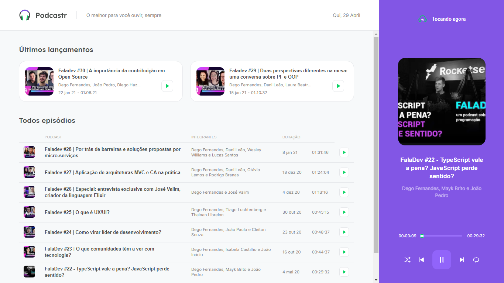

<div align="center">
  
</div>

<br>
<p>
  O podcast <strong>< Fala Dev ></strong> agora em uma plataforma exclusiva. Orgulhosamente desenvolvido durante a NLW 5
</p>
<br><br>



## Tecnologias usadas durante o desenvolvimento
- [ReactJS](https://reactjs.org/)
- [Typescript](https://www.typescriptlang.org/)
- [Next.js](https://nextjs.org/)


**Rodar projeto**

```bash
# Install the dependencies
$ yarn

# Run the backend fake server
$ yarn server

# Run the web server
$ yarn dev
```

<p> Desenvolvido durante o NLW 5 </p>

## Feito por

<table>
  <tr>
    <td align="center">
      <a href="https://www.linkedin.com/in/gustavo-mendes-00661318b/">
        <br>
        <sub>
          <b>Gustavo Mendes</b>
        </sub>
      </a>
    </td>

     <td align="center">
      <a href="https://avatars.githubusercontent.com/u/2254731?v=4">
        <br>
        <sub>
          <b> Diego Fernandes </b>
        </sub>
      </a>
    </td>


  </tr>
</table>

### Esse repositório tem uma licença MIT
